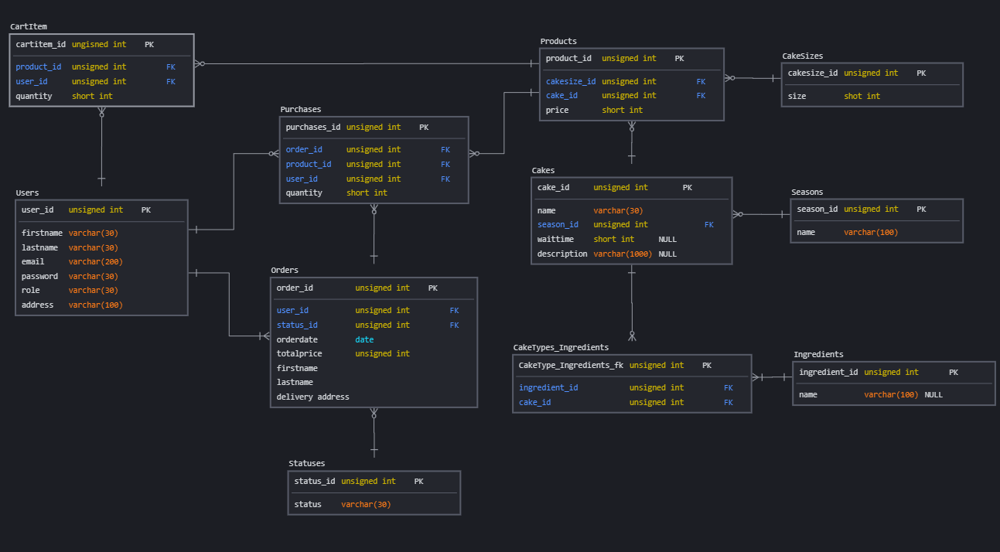

#  Cakeeey Admin Site and RESTful API

The Admin site is used for product and order management. The management site can be found [here](https://cakeeey.onrender.com)

## Context

- The site management was built with [Express.js](https://expressjs.com/). along side the view engine [hbs](https://www.npmjs.com/package/hbs)
- The front-end react project can be found [here](https://github.com/MarcusCWD/Cakeeey-front)

## Database document design

 

# Endpoints

End Point Type | End Point Name | Purpose
------------ | ------------- | -------------
Get | /api/cart/:user_id | Obtain all current infomation of user's cart
Post | /api/cart/:user_id/:product_id/add | Create infomation on user's cart with the specific product
Post | /api/cart/:user_id/:product_id/:qty/update | Update infomation on user's cart on the specific product
Delete | /api/cart/:user_id/:product_id/delete | Delete infomation on user's cart on the specific product
Get | /api/checkout/:user_id | Redirect to Stripe payment with the user id and infomation
Post | /api/checkout/process_payment | When the Stripe payment is completed, will do a post
Get | /api/order/:user_id/user | Obtain all orders by the user
Get | /api/order/:order_id/order | Obtain the particular order by order id
Get | /api/products/ | Obtain all possible product combinations
Get | /api/products/cakes | Obtain all cake infomation
Get | /api/products/cakes/:cake_id | Obtain infomation on a particular cake and its possible product variant
Post | /api/products/search | Search database for name and or season
Get | /api/products/seasons | Obtain all season infomation

# Technologies Used

- [Express.js](https://expressjs.com/)

  The Admin site and API uses Express .js, a fast, unopinionated, minimalist web framework for Node.js

- [Postgres](https://www.postgresql.org/)

  Render deployment natively uses postgres

- [MySql](https://www.mysql.com/)

  Used for testing within local environment

- [BookShelf ORM](https://bookshelfjs.org/)

  Used for backend. Object-Relational Mapping

- [db migrate](https://www.npmjs.com/package/db-migrate)

  Used for backend to create migration files 

# Deployment

- [Render](https://dashboard.render.com/)

  This API is deployed using Render.

# Acknowledgements

Stackoverflow community for countless free tutorials and help on RESTful API development, validation and documentation.